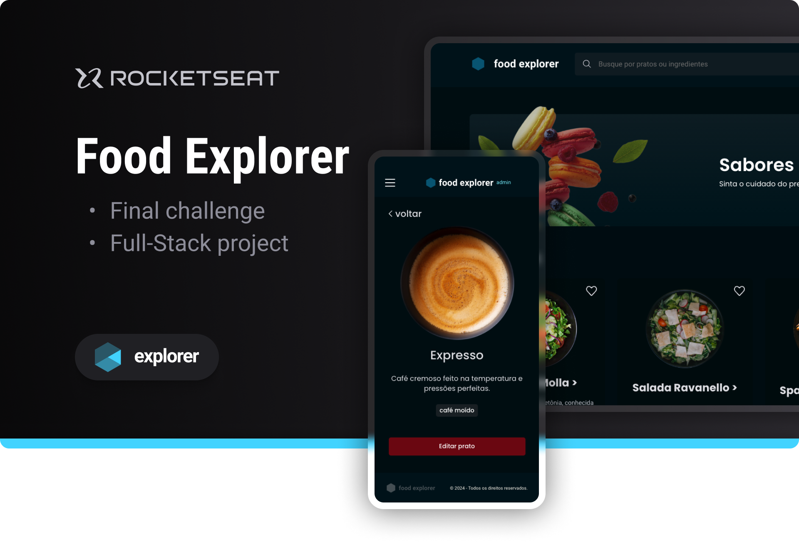

# 

Final Challenge of Rocketseat Explorer, a full-stack formation.

**Food Explorer is a digital menu application for a fictional restaurant, developed to put into practice the back-end and front-end concepts developed during the Explorer formation**



## 📋 Project information

- Rocketseat Explorer
- Final challenge

## 🔗 Project Links

- 🚀 [**Deploy**](https://foodexplorer-api-dhrq.onrender.com)
- 🎨 [**Figma**](https://www.figma.com/community/file/1196874589259687769)
- 🔙 [**Back-end**](https://github.com/emanueltavecia/foodexplorer-web)

## Registered Users

- Admin user:

  - Email: admin@mail.com
  - Password: 12345

- Customer user:
  - Email: user@mail.com
  - Password: 12345

## Functionalities

- LogIn
- SignUp
- View registered dishes
- Register dishes
- Search for dishes by name or ingredient
- Logout

## Pages

- LogIn
- SignUp
- Home
- Dish details
- New dish
- Dish edit

## Running the project

- Clone the web project:
  ```bash
  git clone https://github.com/emanueltavecia/foodexplorer-web.git
  ```
- Access project folder:
  ```bash
  cd foodexplorer-web
  ```
- Install dependencies:
  ```bash
  npm install
  ```
- Run project:
  ```bash
  npm run dev
  ```
- 🎉 Finished, now you can access "http://localhost:5173/" on your browser and test the application.

## 💻 Technologies


### Dependencies

- axios
- react
- react-router-dom
- styled-components
- vite
- keen-slider

## 📄 License

This project is licensed under the MIT License - see the [LICENSE](./LICENSE) file for more details.
